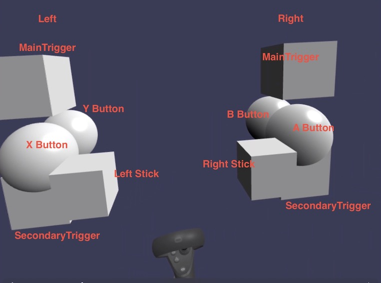

# babylonjs-oculus-quest-controller-input

## Build

```bash
$ npm init --y
$ npm install --save-dev express
```

## Try

```bash
$ node server.js
```

Access "http://<IPaddress>:8001" on Oculus browser.

## Image



## Movie

[](https://youtu.be/DxpHsjoAxmA)  

## Reference

https://www.crossroad-tech.com/entry/babylonjs-oculusquest-controller-input
